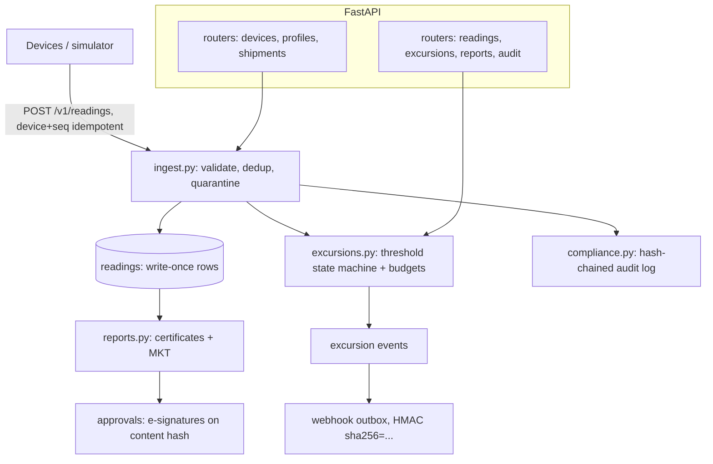

# ColdChain

IoT ingestion platform for temperature-sensitive supply chains (pharma, food,
biologics). Devices stream readings, storage is immutable, and a compliance
audit trail lets you prove the cold chain never broke.

**Who it's for:** quality teams running GDP/GMP shipments who need excursion
budgets, MKT (USP <1079>), calibration coverage, and Part-11-style electronic
signatures — without a full LIMS.

## Architecture



Auth is per-org API keys (`X-API-Key`). All temperatures are integer
millidegree Celsius — never float on the wire or in storage.

## 60-second quickstart

```bash
pip install -e ".[dev,test]"
python -m coldchain.cli provision-org --name "Acme"
# {"org_id": "<ORG>", ..., "api_key": "<KEY>"}
export KEY=<KEY>
python -m coldchain.cli register-device --org-id $ORG --serial SN-001 --name "Fridge 1"
python -m coldchain.cli serve &
```

Create a profile, calibrate, ship, and stream:

```bash
curl -s -X POST localhost:8000/v1/profiles -H "X-API-Key: $KEY" \
  -H 'Content-Type: application/json' \
  -d '{"name":"2-8C","temp_min":"2","temp_max":"8","unit":"C","max_excursion_minutes":30}'
curl -s -X POST localhost:8000/v1/devices/<DEV>/calibrations -H "X-API-Key: $KEY" \
  -H 'Content-Type: application/json' \
  -d '{"valid_from_ms":0,"valid_until_ms":9999999999999,"certificate_ref":"CAL-1"}'
curl -s -X POST localhost:8000/v1/shipments -H "X-API-Key: $KEY" \
  -H 'Content-Type: application/json' \
  -d '{"reference":"S-1","profile_id":"<PROF>","device_ids":["<DEV>"],"started_at_ms":1712000000000}'
curl -s -X POST localhost:8000/v1/readings -H "X-API-Key: $KEY" \
  -H 'Content-Type: application/json' \
  -d '{"device_id":"<DEV>","seq":0,"ts_ms":1712000060000,"temperature":"5.0","unit":"C"}'
```

Certificate + sign-off:

```bash
curl -s localhost:8000/v1/reports/shipments/<SHIP>/certificate -H "X-API-Key: $KEY"
curl -s -X POST localhost:8000/v1/reports/shipments/<SHIP>/approve -H "X-API-Key: $KEY" \
  -H 'Content-Type: application/json' \
  -d '{"signer_name":"Ada","signer_email":"ada@example.com","meaning":"approved","statement_hash":"<HASH>"}'
```

Or simulate a whole fleet: `python -m coldchain.cli simulate --org-id $ORG --devices SN-001 --minutes 120 --seed 7`.

## Design decisions

- **Millidegree-C integers.** API takes decimal strings (`"5.0"`, unit C/F/K);
  `temp.py` converts to `int` millidegree with physical-range guards.
- **Idempotency by device+seq.** Replays return the stored row; same seq with
  different payload is rejected (422) as a device bug or spoof.
- **Write-once readings.** Measurement columns are never UPDATE'd; corrections
  create superseding rows. `status` (accepted/quarantined/superseded) is
  lifecycle metadata.
- **Quarantine, never drop.** Uncalibrated or future-skewed readings are stored
  and flagged — dropping data is a compliance violation.
- **Inclusive bounds, MKT per USP <1079>.** Excursion budgets accumulate open
  and closed excursions; MKT uses ΔH=83.144 kJ/mol.
- **Content-only statement hash.** `generated_at_ms` and the approvals ledger
  are excluded so the signed hash is stable; approval requires exact match
  (anything else is 409 stale), and in-transit records cannot be signed (422).
- **Period locks.** Locked months reject new ingestion (409).

Config is env-driven with the `COLDCHAIN_` prefix (`config.py`). See
`.env.example`.

## API

All org routes require `X-API-Key`. Errors: 401 bad key, 404 wrong-org/missing,
409 conflict (retired device, locked period, stale approval, double close),
422 validation.

| Method | Path | Notes |
| --- | --- | --- |
| GET | `/health` | liveness, no auth |
| POST | `/v1/devices` | `serial, name, model`; `Idempotency-Key` ok |
| GET | `/v1/devices` | list |
| GET | `/v1/devices/{device_id}` | detail |
| POST | `/v1/devices/{device_id}/retire` | retired devices reject readings |
| POST | `/v1/devices/{device_id}/calibrations` | `valid_from_ms, valid_until_ms, certificate_ref` |
| GET | `/v1/devices/{device_id}/readings` | `since_ms, limit` |
| POST | `/v1/profiles` | `name, temp_min/max (+unit), max_excursion_minutes, mkt_limit?` |
| GET | `/v1/profiles` | list |
| POST | `/v1/shipments` | `reference, profile_id, device_ids[], ...`; `Idempotency-Key` ok |
| GET | `/v1/shipments` | list |
| GET | `/v1/shipments/{id}` | detail + stats |
| POST | `/v1/shipments/{id}/complete` | `ended_at_ms?` |
| POST | `/v1/readings` | single; native (device,seq) idempotency |
| POST | `/v1/readings/batch` | ≤500 items, per-item results |
| POST | `/v1/readings/{id}/supersede` | correction as new row |
| GET | `/v1/excursions` | `shipment_id, status, limit` |
| GET | `/v1/reports/shipments/{id}/certificate` | verdict + statement_hash |
| POST | `/v1/reports/shipments/{id}/approve` | e-signature on exact hash |
| GET | `/v1/audit` | hash-chained log |
| GET | `/v1/audit/verify` | chain check |
| POST | `/v1/periods/lock` | `period: YYYY-MM` |
| POST | `/v1/webhook-endpoints` | https or http://localhost |
| POST | `/v1/webhooks/dispatch` | deliver due outbox items |

CLI (`python -m coldchain.cli <cmd>`): `provision-org --name`,
`register-device --org-id --serial`, `serve`, `simulate`, `report --shipment-id`,
`lock-period`. All take `--db` (default `COLDCHAIN_DATABASE_URL` or
`sqlite:///./coldchain.db`).

## Testing / quality

```bash
make test       # pytest
make lint       # ruff check + format --check
make typecheck  # mypy strict
make e2e        # live server smoke test
make audit      # pip-audit on the lockfile
```

## Project layout

```
src/coldchain/
  api.py          # factory, /health, error mapping
  auth.py         # API-key hashing / verification
  cli.py          # provision, register, serve, simulate, report, lock
  compliance.py   # audit chain, approvals, period locks
  config.py       # COLDCHAIN_* settings
  db.py           # engine / session factory
  deps.py         # require_org, idempotency helpers
  excursions.py   # threshold engine, budgets, MKT
  ingest.py       # devices, calibrations, reading intake
  models.py       # orgs, devices, readings, excursions, audit, ...
  reports.py      # shipment certificates
  routers/        # devices, profiles, shipments, readings, ...
  schemas.py      # Pydantic request shapes
  temp.py         # millidegree parsing / formatting
  webhooks.py     # outbox enqueue, HMAC sign, dispatch
```

## Limitations

- **SQLite default**; Postgres works via `COLDCHAIN_DATABASE_URL` (needs a
  driver added — see compose comments).
- **Single-node.** Concurrent writers rely on DB transactions.
- **Part-11-style, not certified.** E-signatures bind name+meaning to a content
  hash; there is no identity proofing or independent review workflow.
- **No alerting rules engine.** Excursion webhooks fire; escalation policies
  don't exist yet.
- **No TOTP/hardware keys.** API keys + password-less device ingestion only.
